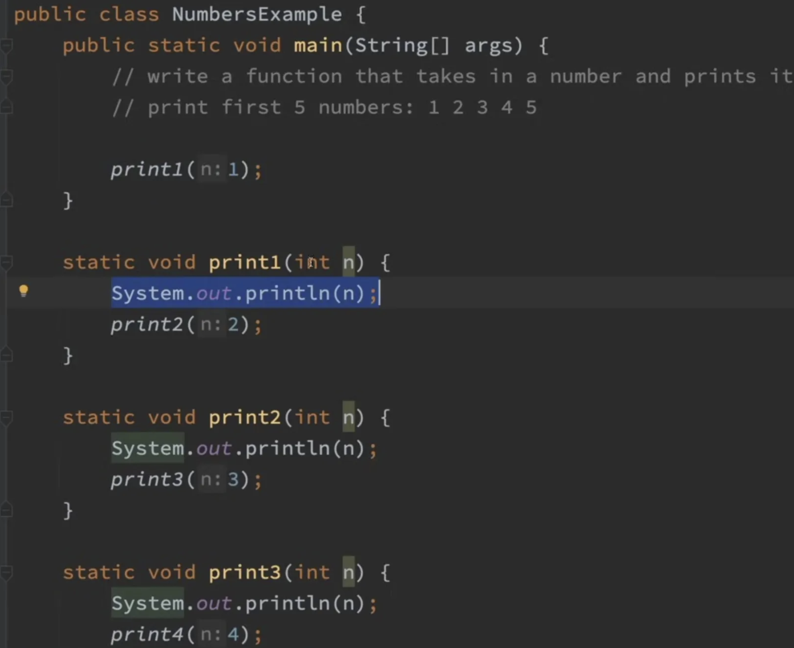
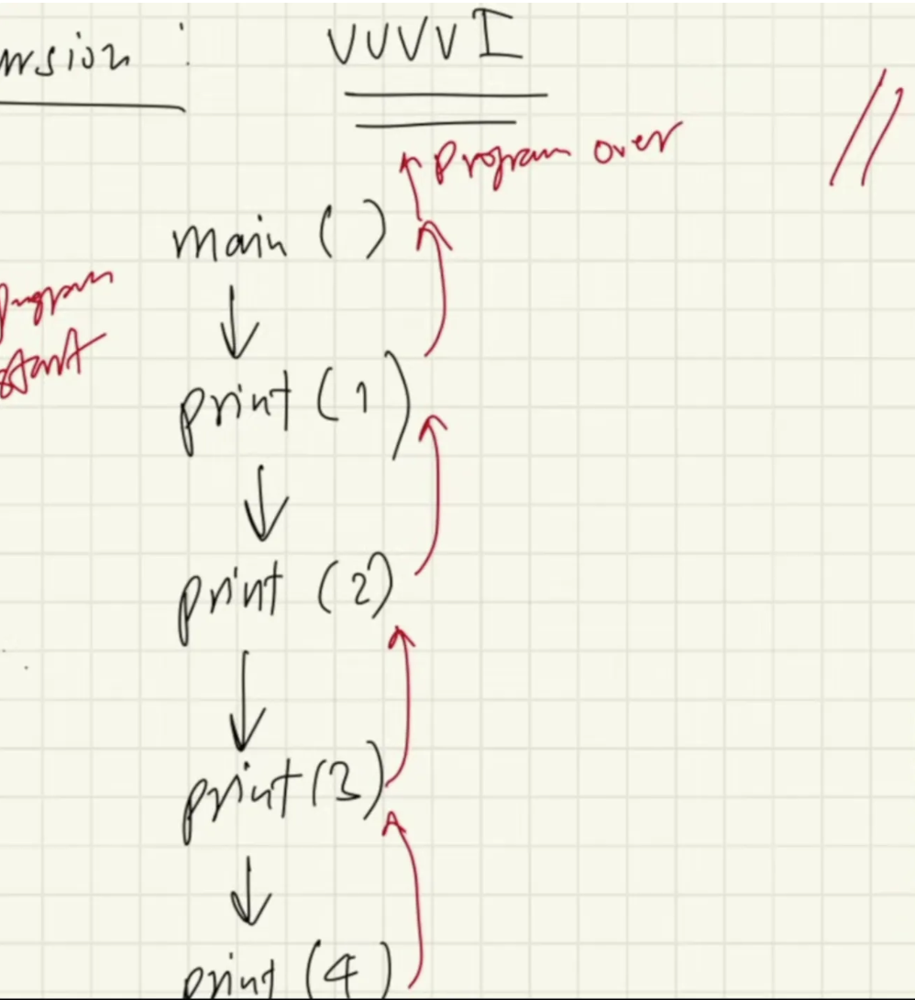
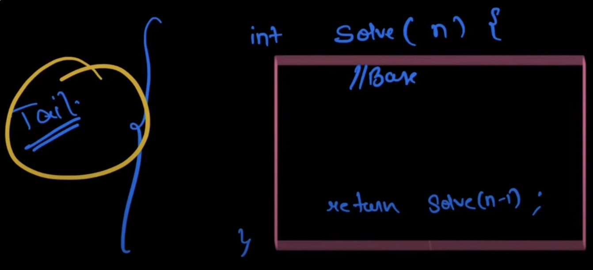
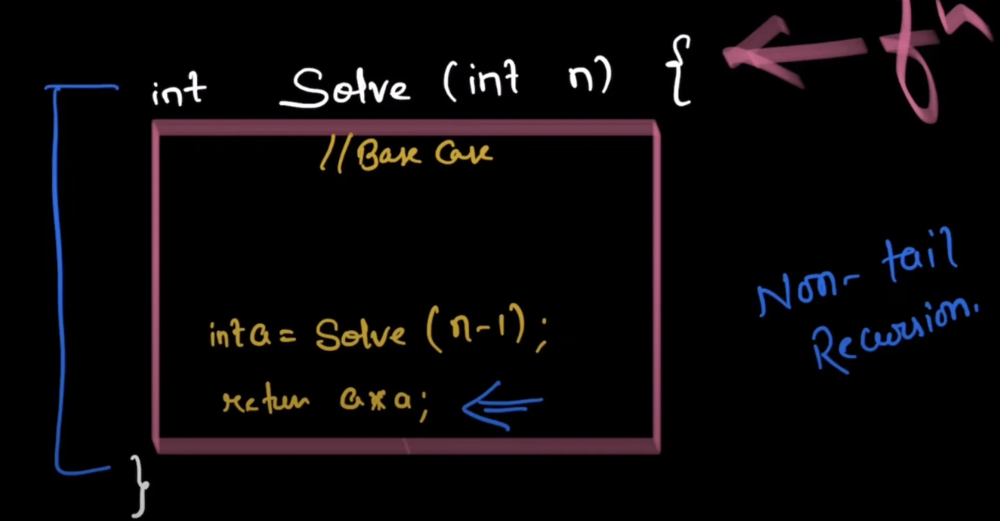
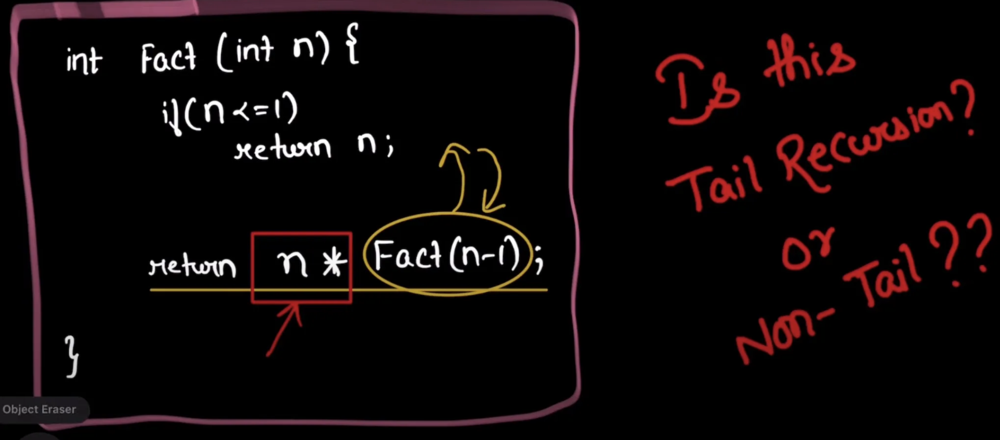
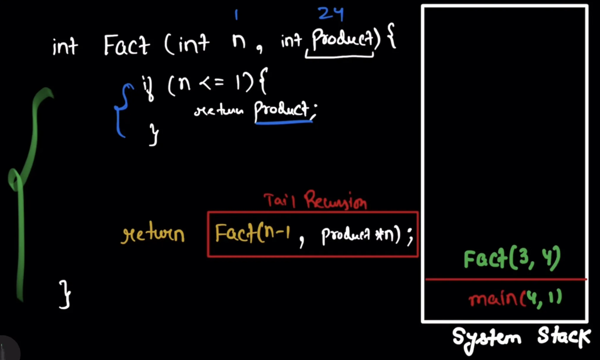
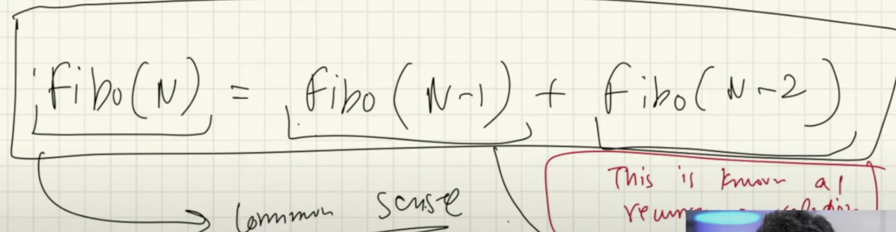

# Recursion

Recursion means a function calling itself.

**Hint:** If there is options than always think of recursion

**How Recursion Works in Stack ?**


<br>

**We make use of Recursion Tree to visualise recursion problems:**



<br>

```java
public class Print1toN {
    public static void main(String[] args) {
        System.out.println("Print 1 to n using recursion");
        print1toN(5);
        printNto1(5);
    }

    private static void print1toN(int n) {
        if(n == 0)
            return;

        print1toN(n-1);
        System.out.println(n);
    }

    private static void printNto1(int n) {
        if(n == 0)
            return;

        System.out.println(n);
        print1toN(n-1);
    }
}
```

<br>

**Tail Recursion**

Form of recursion, where the recursive call is the last operation performed in the function.



**Non-Tail Recursion**



**Below Code is Tail or Non-Tail ?**



Its non-tail because after calling Fact(n - 1) we’re multiplying its result with n.

**Now converting non-tail recursion to Tail recursion**



Here, we’ve introduced another parameter i.e., product which is being return from recursive function in Base Case.

Now because of this modern compilers are smart enough to not maintain function call in stacks as they are not needed after being called.

When we write recursion in formula its called **Recurrence Relation.**



- We use recursion to solve bigger/complex problem in a simpler way which is very difficult in iterative way.
- Every recursive function call take separate space in stack
- Recursive solutions can be converted into iterative solutions and vice-versa.

**How to Solve Recursive Problems:**

- Identify if you can break down the problem into smaller one.
- Write the recurrence relation if needed.
- Draw the Recursion Tree
- About the Tree:
    - See the flow of functions, how they are getting in stacks
    - Identify & focus on left tree calls and than right tree calls
    - Draw the tree and pointer again & again using pen & paper.
    - Use a debugger to see the flow.
- See how the values & what type of values are returned in each step.
- And see where the function call comes out of
- The base condition is represented by answer we already know

**Variables in Recursion:**

- Arguments passed to the recursive function.
- Return type of recursive function.
- Body of the function

## Basic Recursion Problems:

### 1. Factorial

eg: 4! = 4 * 3 * 2 * 1

```java
public class Factorial {
    public static void main(String[] args) {
        System.out.println("Factorial of a number");
        System.out.println(factorialOfNth(5));
    }

    private static int factorialOfNth(int n) {
        // Base case
        if(n == 1)
            return n;

        return n * factorialOfNth(n-1);
    }
}
```

### 2. Fibonacci
- Sequence of numbers formed from summation of its previous 2 numbers

eg: 0 1 1 2 3 5 8 13 21 36

**Complexity:**

**Time:** O(2^n)

**Space:** O(n)

```java
public class Fibonacci {
    public static void main(String[] args) {
        System.out.println("Fibonacci of nth number");
        
        System.out.println(fibonacii(6));
    }

    private static int fibonacii(int n) {
        if(n <= 1)
            return n;
            
        return fibonacii(n-1) + fibonacii(n-2);
    }
}
```

### 3. Sum & Product of Digits

```java
public class SumOfDigits {
    public static void main(String[] args) {
        System.out.println("Sum of Digits");
        
//        System.out.println(sumOfDigits(5234));
        System.out.println(productOfDigits(5234));
    }

    private static int sumOfDigits(int n) {
        // Base Condition
        if(n <= 0)
            return 0;

        return (n % 10) + sumOfDigits(n / 10);
    }

    private static int productOfDigits(int n) {
        // Base Condition
        if(n <= 0)
            return 1;

        return (n % 10) * productOfDigits(n / 10);
    }
}
```